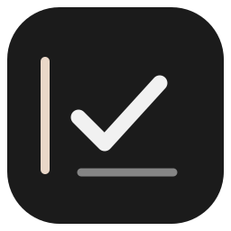

# SideTodo

**필요할 때만 펼쳐지는, 화면 가장자리의 작은 할 일 위젯.**

A quiet, local-first Windows to-do widget. Hover to check your day, type inline, and keep your completion history.

작업 중 다른 앱을 열지 않고 할 일을 확인하고 적을 수 있도록 만든 Windows 데스크톱 앱입니다. 평소에는 화면 왼쪽에 작은 바만 남고, 마우스를 가까이 가져가면 체크리스트가 펼쳐집니다. 흑백 디자인과 부드러운 크기 변화로 작업 화면에 가볍게 붙어 있습니다.

## 다운로드

**[최신 릴리스](https://github.com/yoshi-power/SideTodo/releases/latest)** 에서 `SideTodo-1.0.0-win-x64.zip`을 받으세요.

1. ZIP을 원하는 폴더에 모두 압축 해제합니다.
2. `SideTodo.exe`를 실행합니다.
3. 화면 왼쪽의 작은 바 근처로 마우스를 옮깁니다.

Windows 10/11 **64비트(x64)** 용입니다. 배포본에 .NET 런타임이 포함되어 있어 별도 설치가 필요 없습니다. 설치 프로그램과 관리자 권한도 필요 없습니다. 첫 실행은 런타임 준비 때문에 조금 더 걸릴 수 있습니다. 현재 배포본은 코드 서명이 없는 포터블 앱입니다.

## 할 일을 적는 흐름

| 기능 | 사용 방법 |
| --- | --- |
| 오늘 / 앞으로 | 오늘과 지난 미완료 작업, 나중에 할 작업을 나누어 봅니다. |
| 바로 입력 | 빈 체크 줄에 적고 **Enter**. 다음 항목을 바로 이어 적습니다. |
| 상세 일정 | **+**로 메모·날짜를 작성합니다. 긴 글은 창이 커지며 줄바꿈됩니다. |
| 호버 편집 | 항목에 잠시 머무르면 옆에 상세 창이 열립니다. 확인과 수정을 같은 자리에서 합니다. |
| 창 이동 | 상세 창 상단을 잡아 편한 위치로 옮깁니다. |
| 완료 처리 | 체크박스를 누르면 항목이 접히며 완료 보관함에 쌓입니다. |
| 완료 보관함 | **▤**에서 완료순 정렬, 실수한 항목 복구, 기록 내보내기를 합니다. |
| AI에 활용 | 완료 기록을 **Markdown / JSON** 파일로 저장해 원하는 도구에 직접 전달합니다. |

상세 창의 **완료**는 편집 내용을 저장하는 버튼입니다. 작업을 끝냈다는 표시는 목록의 **체크박스**로 합니다.

## 작업을 방해하지 않도록

- 접혔을 때는 작은 바 하나, 마우스가 근처를 지나가면 열리는 넓은 감지 범위.
- 입력 중에는 넉넉한 입력 칸, 읽을 때는 작은 체크리스트.
- 클릭하거나 편집하기 시작한 호버 창은 자동으로 닫히지 않음.
- 작업 표시줄과 Alt+Tab에는 나타나지 않으며 시스템 트레이에서 제어.
- 계정, 서버, 클라우드 동기화 없이 로컬 파일에 저장.

**[자세한 사용법](docs/USER-GUIDE.ko.md)** · **[처음 실행하기](docs/START-HERE.ko.md)** · **[변경 기록](CHANGELOG.md)**

## 데이터와 업데이트

할 일은 `%LOCALAPPDATA%\SideTodo\tasks.json`, 이전 저장본은 `tasks.json.bak`에 저장됩니다. 배포 ZIP과 이 저장소에는 사용자의 할 일이 포함되지 않습니다.

업데이트는 트레이에서 앱을 종료한 뒤 실행 파일을 새 버전으로 교체하면 됩니다. 데이터는 실행 폴더와 분리되어 유지됩니다. 다른 컴퓨터로 옮길 때는 앱을 종료하고 데이터 파일을 복사하세요.

자동 시작·알림·클라우드 동기화는 제공하지 않습니다. 위젯의 기준 위치는 주 모니터 왼쪽입니다. 이전 버전에서 완료한 항목은 당시 완료 시각을 기록하지 않았으므로 보관함에 `시간 미기록`으로 표시됩니다.

## 소스에서 빌드

Windows와 .NET 8 SDK가 필요합니다. 애플리케이션 코드는 WPF와 Windows Forms를 사용하며 추가 NuGet 라이브러리에 의존하지 않습니다.

```powershell
dotnet build -c Release
dotnet run -c Release --project SideTodo.csproj
```

런타임 포함 ZIP과 SHA-256 체크섬 생성:

```powershell
powershell -NoProfile -ExecutionPolicy Bypass -File .\build-release.ps1
# 실제 데스크톱에서 UI 회귀 검증까지 실행
powershell -NoProfile -ExecutionPolicy Bypass -File .\build-release.ps1 -VerifyUI
```

결과물은 `dist/`에 저장됩니다. 스크립트는 완료 기록·복구·정렬·내보내기·저장 검증을 실행한 뒤 명시된 파일만 ZIP에 넣습니다. `-VerifyUI`는 임시 데이터로 입력, 반응형 배치, 달력, 호버 편집, 보관함을 추가 검증합니다.

## 프로젝트 구조

- `Widget.cs`: 가장자리 위젯, 체크리스트, 입력과 애니메이션
- `DetailWindow.cs`, `MiniCalendar.cs`: 상세·호버 편집과 달력
- `ArchiveWindow.cs`, `CompletionArchive.cs`: 완료 기록·복구·내보내기
- `Program.cs`: 로컬 저장소, 앱 진입점, 데이터 검증
- `DesktopIntegration.cs`: 마우스 근접 감지와 Windows 창 설정
- `build-release.ps1`: 테스트 및 Windows x64 배포 패키징

포함된 .NET 런타임의 라이선스와 고지는 배포본의 `licenses/` 및 [서드파티 고지](THIRD-PARTY-NOTICES.md)를 확인하세요.
